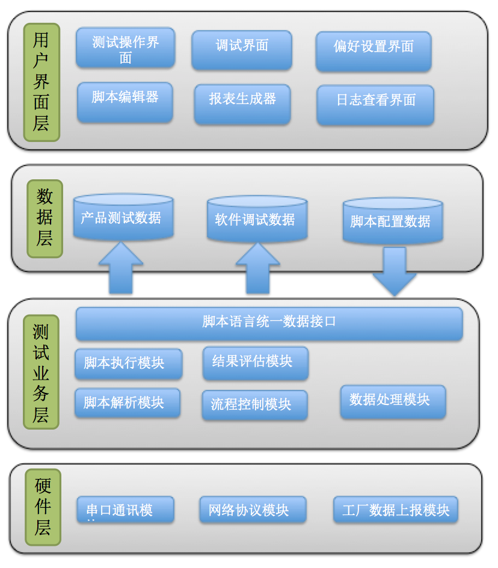

# 测试平台架构说明


```
版本：1.0.0 
日期：2017/05/08

```

#### 功能

> 为了实现工程师快速地构建和部署测试系统。该测试平台需要支持多机台，多产品进行并行测试。软件的功能也需要全部模块化，测试引擎支持多语言的拓展，脚本编辑界面必须功能强大且操作简单，具备本地测试数据保存以及工厂数据上报功能，支持自动化测试的网络协议。

## 架构图

<br/>
<br/>

<div align=center>

</div>
<br/>

## 模块
### 1. 用户界面层的所有模块

	1.1 测试操作界面
	1.2 脚本编辑界面
	1.3 偏好设置界面
	1.4 报表查询界面
	1.5 日志查看界面
	1.6 调试界面


#### 1.1 测试操作界面

每台测试机对应操作界面上的一个区域，有多少个测试机就有多少个测试区域显示出来。如果一台测试机包含多个测试slot那么每个测试区域的列表信息需要自动增加slot的数据。测试区域测包含以下内容：

* 开始测试按钮、暂停测试按钮、取消测试按钮。
* 测试机台信息扫描界面。
* 显示测试数据的列表（测试名称、测试数值、测试结果等）。
* 显示测试时间信息。
* 显示测试产品的日志信息。

#### 1.2 脚本编辑界面
脚本编辑界面提供测试引擎的脚本编译功能。测试环境参数的配置，报表格式的配置。主要功能如下：

* Sequences编辑面板(测试步骤的复制、剪切、粘贴)
* 参数编辑面板 (测试名称修改、测试limits设置、测试环境参数设置)
* 变量编辑面板 (全局变量、本地变量、环境变量)
* 测试功能面板 (测试用例、流程控制等)

#### 1.3 偏好设置界面

偏好设置主要用来配置软件运行的环境参数，比如：测试日志保存的路径、当前测试工站的夹具数量，每个夹具的slot数量、PDCA、SFC的网络地址等等。

* 通用参数配置页
* 硬件参数配置页
* 网络参数配置页

#### 1.4 报表查询界面

以图文的形式展示每个测试机台的、每个slot的良率报告、UPH等信息

#### 1.5 日志查看界面

提供S/N查找功能，显示产品测试、调试log信息

#### 1.6 调试界面

针对通用硬件平台提供统一的调试界面。包括气缸运动控制，测试针点上点控制、sensor状态读取的功能。

### 2. 数据层

	2.1 产品测试数据
	2.2 软件调试数据
	2.3 脚本配置数据

#### 2.1 产品测试数据

产品测试数据包括UUT测试log文件、上传到工厂数据库的csv格式的数据。以及对应的本地数据库文件。

#### 2.2 软件调试数据

包括测试机的硬件通讯数据、产品UUT的串口通讯数据、网络通讯数据。

#### 2.3 脚本配置数据

测试脚本的的sequnce文件，包含所有的测试流程、变量、数据等信息。
每一个测试slot共用一份测试sequnce文件。

### 3. 测试逻辑业务层
	3.1 脚本语言统一接口
	3.2 脚本解析模块
	3.3 脚本执行模块
	3.4 测试结果评估模块
	3.5 流程控制模块
	3.6 数据处理模块

#### 3.1 脚本语言统一接口

定义脚本语言对外统一的接口。减少因脚本语言的差异对上层接口造成的影响。

#### 3.2 脚本解析模块

解析sequnce文件。并生成 *执行模块* 可运行的接口、函数。

#### 3.3 脚本执行模块

执行 *解析模块* 传递过来的测试用例。测试返回值传递给 *结果评估* 模块判断 pass、fail。

#### 3.4 测试结果评估模块
根据用户设定的limits数值或者进行布尔判断测试结果。并将结果传递给 *数据处理模块*

#### 3.5 流程控制模块

控制测试流程包括 循环、条件判断、跳转等逻辑。

#### 3.6 数据处理模块
将测试产生的数据传递给 *数据层* 


### 4. 硬件层模块
	4.1 串口通讯模块
	4.2 网络协议模块
	4.3 工厂数据上报模块
	
#### 4.1 串口通讯模块

实现对串口的读写操作、以及参数配置。支持同步跟异步两种方式。

#### 4.2 网络协议模块

实现自动化测试协议。响应自动化操作。

#### 4.3 工厂数据上报模块

实现PDCA、SFC的数据上报功能。


